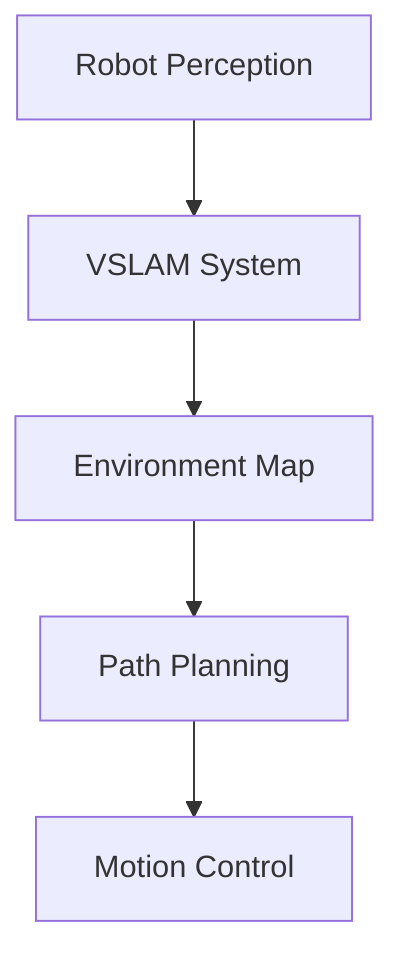

# Reusable Components for Robotics Diagrams and Code Examples

## Diagram Components

For robotics diagrams, Docusaurus supports several approaches:

1. **Static Images**: Place in `static/img/module-3/` and reference with ``

2. **Mermaid Diagrams**: Use Docusaurus's built-in Mermaid support:


3. **Code Blocks with Syntax Highlighting**: Use standard Markdown code blocks with language specification

## Code Example Components

### Standard Code Block Format
````md
import Tabs from '@theme/Tabs';
import TabItem from '@theme/TabItem';

<Tabs>
<TabItem value="python" label="Python">
```python
# Python code example
import robotics
robot = robotics.Robot()
robot.move_forward()
```
</TabItem>
<TabItem value="bash" label="Bash">
```bash
# Bash command example
ros2 run navigation2 nav2_bringup
```
</TabItem>
</Tabs>
````


Note: Use four backticks to wrap the example to prevent MDX processing.

## Recommended Approach

For consistency across the module, use the following standardized components:

1. **Practical Examples**: Use a special admonition block:
```markdown
:::note[Practical Example]
Description of the practical example
:::

```bash
# Code that goes with the example
```

:::caution
Important considerations for the example
:::
```

2. **Exercise Sections**: Use a distinct heading level and style
3. **Key Concept Highlights**: Use info/warning/danger admonitions as appropriate