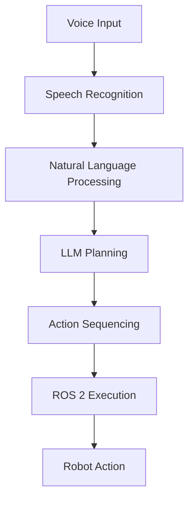
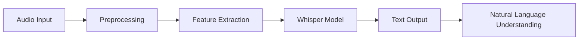
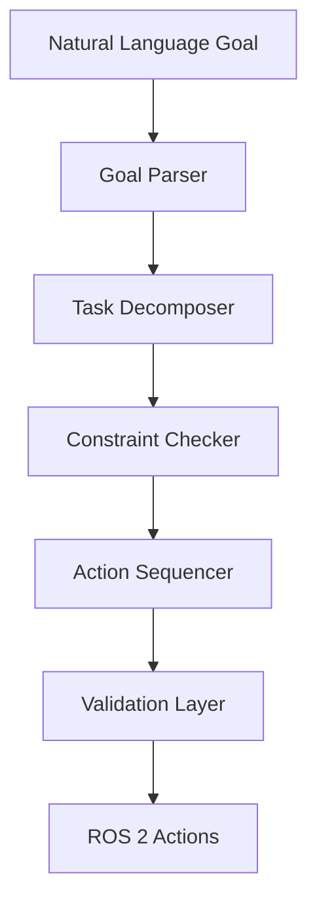

# Reusable Components for Vision-Language-Action (VLA) Module

## Architecture Diagrams

For VLA system diagrams, Docusaurus supports several approaches:

1. **Static Images**: Place in `static/img/module-4/` and reference with ``

2. **Mermaid Diagrams**: Use Docusaurus's built-in Mermaid support:


3. **Code Blocks with Syntax Highlighting**: Use standard Markdown code blocks with language specification

## Code Example Components

### Standard Code Block Format
````md
import Tabs from '@theme/Tabs';
import TabItem from '@theme/TabItem';

<Tabs>
<TabItem value="python" label="Python">
```python
# Python code example for VLA system
import openai
from utils import VoiceCommand, Action

def process_voice_command(audio_data):
    # Process voice command using OpenAI Whisper
    transcription = openai.Audio.transcribe(audio_data)
    command = VoiceCommand(
        id="cmd_001",
        text=transcription,
        confidence=0.9,
        context={}
    )
    return command
```
</TabItem>
<TabItem value="bash" label="Bash">
```bash
# Bash command example for setting up VLA environment
source /opt/ros/humble/setup.bash
export OPENAI_API_KEY="your-api-key"
python -m pip install -r requirements.txt
```
</TabItem>
</Tabs>
```

Note: Use four backticks to wrap the example to prevent MDX processing.

## VLA-Specific Components

### Voice Processing Pipeline


### LLM Planning Architecture


### Safety Validation Components
- **Input Validation**: Validate voice commands and LLM outputs
- **Action Validation**: Check robot capabilities and environment
- **Safety Constraints**: Verify actions don't violate safety rules
- **Recovery Mechanisms**: Handle failures gracefully

## Recommended Approach

For consistency across the VLA module, use the following standardized components:

1. **Practical Examples**: Use a special admonition block:
```markdown
:::note[Practical Example]
Example of implementing a voice-controlled navigation system using Whisper and ROS 2 actions.
:::

```python
# Code that goes with the example
```

:::caution
Remember to validate all voice commands before executing robot actions to ensure safety.
:::

2. **Exercise Sections**: Use a distinct heading level and style
3. **Key Concept Highlights**: Use info/warning/danger admonitions as appropriate

## API Reference Components

### Voice Processing API
```
POST /api/vla/voice/process
{
  "audio_data": "base64_encoded_audio",
  "context": {
    "robot_id": "robot_001",
    "environment": "kitchen"
  }
}
Response: {
  "text": "Go to the kitchen and bring me water",
  "confidence": 0.89,
  "commands": ["navigate", "grasp", "transport"]
}
```

### Planning API
```
POST /api/vla/plan/generate
{
  "goal": "Please bring me a glass of water",
  "context": {
    "robot_capabilities": ["navigation", "manipulation"],
    "environment_map": "kitchen_map.yaml"
  }
}
Response: {
  "plan": [
    {"action": "navigate", "params": {"location": "kitchen"}},
    {"action": "locate", "params": {"object": "glass"}},
    {"action": "grasp", "params": {"object": "glass"}}
  ],
  "confidence": 0.92,
  "estimated_time": 180
}
```

### Execution API
```
POST /api/vla/execute
{
  "action_sequence": {
    "id": "seq_001",
    "steps": [
      {
        "type": "navigation",
        "parameters": {"target_pose": {"x": 1.0, "y": 2.0}}
      }
    ]
  },
  "robot_id": "robot_001"
}
Response: {
  "execution_id": "exec_001",
  "status": "started",
  "estimated_completion": "2023-10-15T10:30:00Z"
}
```

## Safety and Validation Components

### Safety Validation Checklist
- [ ] All voice commands validated for confidence > 0.7
- [ ] LLM-generated plans validated against safety constraints
- [ ] Robot capabilities verified before action execution
- [ ] Environmental awareness confirmed before navigation
- [ ] Emergency stop procedures available during execution

### Error Handling Patterns
1. **Graceful Degradation**: When components fail, provide fallback behaviors
2. **User Feedback**: Always inform users of system status
3. **Recovery Procedures**: Implement strategies to return to safe states
4. **Logging**: Comprehensive logging for debugging and safety analysis